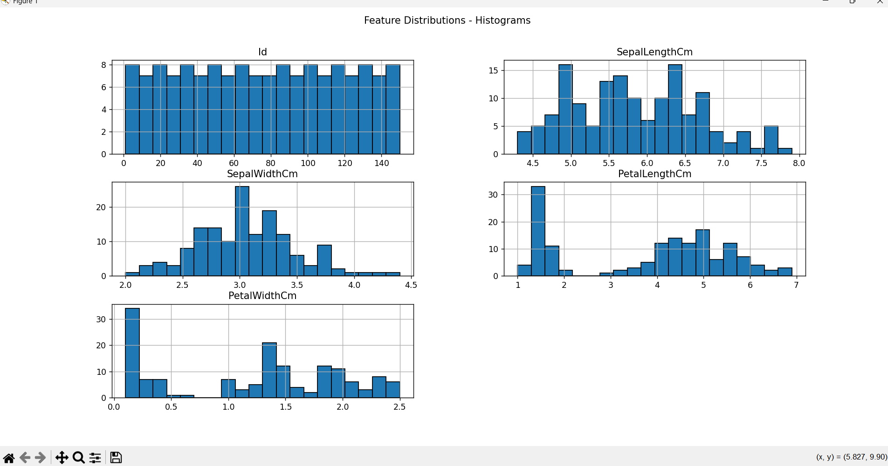
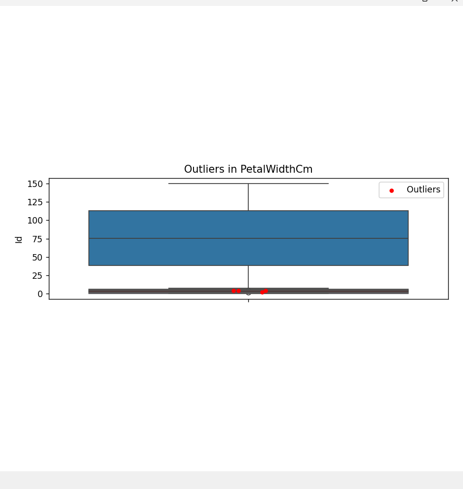
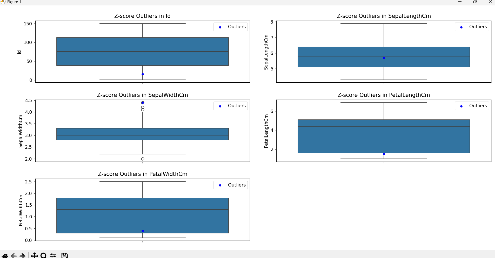

# Data-Viz-Iris-Dataset
We've to perform 1. List down the features and their types (e.g., numeric, nominal) available in the dataset. 2. Create a histogram for each feature in the dataset to illustrate the feature distributions.  3. Create a boxplot for each feature in the dataset.  4. Compare distributions and identify outliers. 

# Result and Output
- Dataset Features:
- Id                 int64
- SepalLengthCm    float64
- SepalWidthCm     float64
- PetalLengthCm    float64
- PetalWidthCm     float64
- Species           object
- dtype: object

# Histplot for all features

# Box Plot for all features

# Outliers (IQR Method):
- Id: 0 outliers
- Empty DataFrame
# Columns: [Id, SepalLengthCm, SepalWidthCm, PetalLengthCm, PetalWidthCm, Species]
- Index: []
- SepalLengthCm: 0 outliers
- Empty DataFrame
# Columns: [Id, SepalLengthCm, SepalWidthCm, PetalLengthCm, PetalWidthCm, Species]
- Index: []
- SepalWidthCm: 4 outliers
## Outliers Detected

The following table lists the detected outliers in the dataset:

| Id  | SepalLengthCm | SepalWidthCm | PetalLengthCm | PetalWidthCm | Species         |
|---- |--------------|-------------|--------------|-------------|---------------|
| 16  | 5.7         | 4.4         | 1.5          | 0.4         | Iris-setosa   |
| 33  | 5.2         | 4.1         | 1.5          | 0.1         | Iris-setosa   |
| 34  | 5.5         | 4.2         | 1.4          | 0.2         | Iris-setosa   |
| 61  | 5.0         | 2.0         | 3.5          | 1.0         | Iris-versicolor |

  
# PetalLengthCm: 0 outliers
- Empty DataFrame
# Columns: [Id, SepalLengthCm, SepalWidthCm, PetalLengthCm, PetalWidthCm, Species]
- Index: []
- PetalWidthCm: 0 outliers
- Empty DataFrame
# Columns: [Id, SepalLengthCm, SepalWidthCm, PetalLengthCm, PetalWidthCm, Species]
- Index: []
# Outliers (Z-score Method):
   ### Outliers (Z-score Method)
The following table lists the detected outliers in the dataset using the Z-score method:

| Id  | SepalLengthCm | SepalWidthCm | PetalLengthCm | PetalWidthCm | Species      |
|---- |--------------|-------------|--------------|-------------|------------|
| 16  | 5.7         | 4.4         | 1.5          | 0.4         | Iris-setosa |

